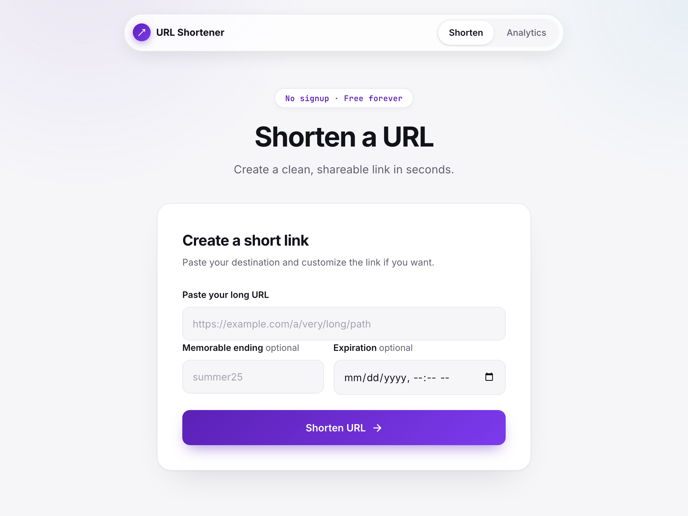
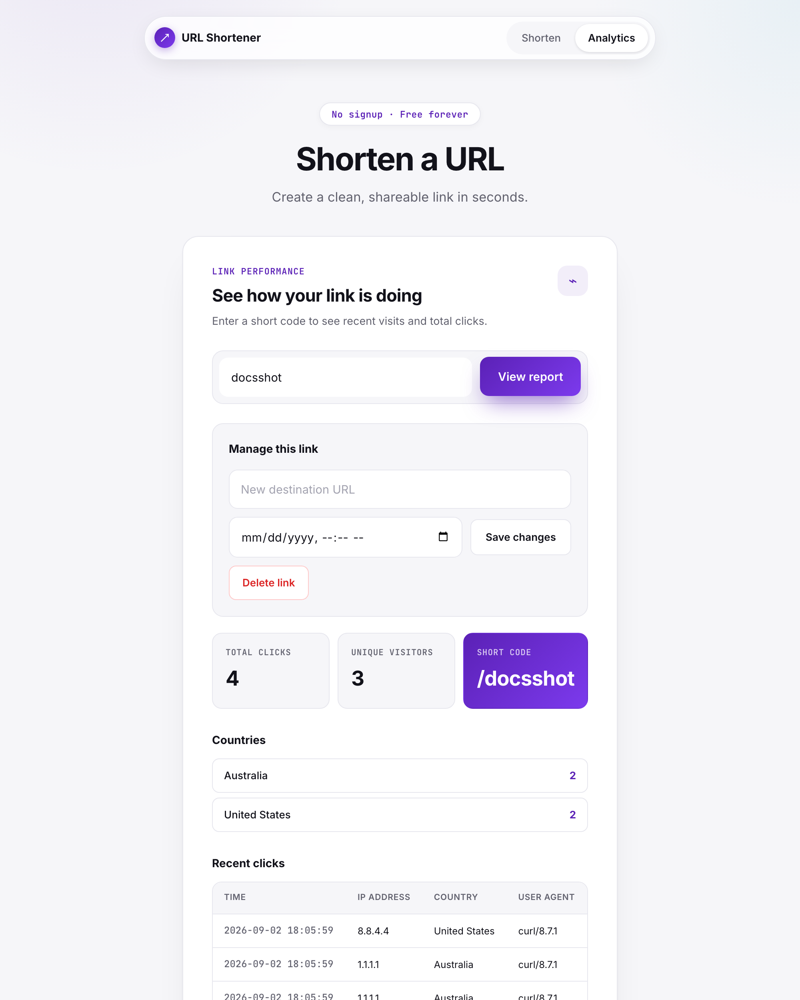

# URL Shortener

A full-stack URL shortener that creates custom, expiring links and provides click and visitor analytics. Built with **Java 21**, **Spring Boot**, **Angular**, **PostgreSQL**, **Redis**, and **Apache Kafka**.




## Live application

The application is deployed on AWS EC2 at **[https://short.vinodmaneti.com](https://short.vinodmaneti.com)**.
HTTP requests are redirected to HTTPS, the domain points to an Elastic IP, and Let's Encrypt
certificates renew automatically through Certbot. The public health check is available at
[`/actuator/health`](https://short.vinodmaneti.com/actuator/health); other Actuator endpoints are
not exposed.

The deployment uses system nginx for TLS termination and forwards traffic to the localhost-only
Angular/nginx container. PostgreSQL, Redis, Kafka, and the Spring Boot container are not directly
exposed to the internet. See [`DEPLOYMENT.md`](DEPLOYMENT.md) for the deployed topology and
reproduction steps.

---

## Features

- **Shorten URLs** — paste a long URL, get a short link
- **Duplicate Detection** — shortening the same URL twice returns the existing active code (Redis fast path + authoritative DB lookup)
- **Custom Aliases** — choose your own short code (1–8 alphanumeric chars)
- **Expiration** — optional expiry date for links
- **Update & Delete** — edit a link's destination/expiry (`PUT`) or remove it and its click history entirely (`DELETE`)
- **OpenAPI/Swagger Docs** — interactive API docs at `/swagger-ui/index.html`, raw spec at `/v3/api-docs`
- **Click Analytics** — total clicks, unique visitors, per-country breakdown (via IP geolocation), and a recent-clicks table, viewable in the Angular analytics view
- **Async Analytics (Kafka)** — click events published to Kafka, consumed and persisted in the background, removing the synchronous DB write from the redirect response path (not independently benchmarked — see `docs/testing.md`)
- **Redis Caching** — bidirectional cache (`short→long`, `long→short`) to reduce DB hits, plus a 24h `geoip:{ip}` cache to avoid re-resolving repeat visitors
- **Bounded Retries** — Redis and GeoIP operations retry transient failures with exponential backoff; Kafka retries producer delivery and consumer processing failures
- **Rate Limiting** — Bucket4j-based, 20 requests/minute per IP (in-memory, per application node)
- **Scheduled Cleanup** — cron job removes expired URLs from DB and cache
- **Angular UI** — light-themed single-page app with a shorten form and an analytics/manage view (see [Web UI](#web-ui))
- **Input Validation** — regex validation to prevent XSS and open redirects
- **Graceful Degradation** — redirects still work if Kafka is down
- **Consistent API Errors** — centralized `@RestControllerAdvice` returns structured JSON errors
- **Restricted Actuator** — public nginx exposes only basic `/actuator/health`; sensitive actuator endpoints are not exposed
- **CI/CD** — GitHub Actions tests both apps, validates Docker images, and deploys `main` to EC2 through short-lived AWS OIDC credentials and SSM (no stored SSH or AWS access keys)
- **Automated Testing** — 53 unit tests plus 9 PostgreSQL-backed integration tests; 90.2% line coverage with an 80% minimum enforced by JaCoCo



---

## AI-Assisted Development Process

This project was built iteratively with Claude, one requirement at a time — every change followed the same loop: **Requirement → Investigate → Options (when genuinely ambiguous) → Implement → Test → Verify live → Document**. The full walkthroughs (including one covering how an earlier version of this very documentation set was itself caught drifting from reality and rewritten) live in [`docs/ai-workflow.md`](docs/ai-workflow.md).

---


## Architecture

> Full detail (system diagram, component roles, schema, codebase layout) lives in
> [`docs/architecture.md`](docs/architecture.md); the reasoning behind specific choices is in
> [`docs/design-decisions.md`](docs/design-decisions.md). The summary below is illustrative.

In production, the browser first reaches system nginx over HTTPS; it forwards to the Angular
container, which proxies `/api/*` and the restricted health endpoint to Spring Boot over the
private Docker network.

```
┌──────────────┐       ┌──────────────────────────────────────────────┐
│   Browser    │       │             Spring Boot App                  │
│              │──────▶│                                              │
│  POST /api   │       │  urlController ──▶ UrlService ──▶ PostgreSQL │
│              │       │       │                  │                   │
│  GET /{code} │       │       │ resolve()        │ Redis Cache       │
│              │◀──302─│       ▼                  ▼                   │
│              │       │  KafkaTemplate.send()  (fire-and-forget)     │
└──────────────┘       └──────────┬───────────────────────────────────┘
                                  │ ~1ms async
                                  ▼
                          ┌──────────────┐
                          │    Kafka     │
                          │  (KRaft)    │
                          │             │
                          │ Topic:      │
                          │ url-click-  │
                          │ events      │
                          └──────┬───────┘
                                 │
                                 ▼
                       ┌──────────────────┐
                       │ ClickEvent       │
                       │ Consumer         │
                       │                  │
                       │ @KafkaListener   │
                       │ ──▶ GeoIpService │ (ipwho.is / ip-api.com, Redis-cached)
                       │ ──▶ DB INSERT    │
                       └──────────────────┘
```

**Without Kafka** (the unused `AnalyticsService.recordClick()` path, kept as a reference point): `GET /{code}` → Redis lookup → synchronous DB INSERT → 302 redirect — the redirect waits on a write it doesn't need to.

**With Kafka** (what actually runs): `GET /{code}` → Redis lookup → fire-and-forget Kafka publish → 302 redirect → consumer persists in the background. This removes the synchronous write from the response path; it has not been independently benchmarked in this deployment (see [`docs/testing.md`](docs/testing.md)).

---

## Tech Stack

| Layer                  | Technology                                       |
| ---------------------- | ------------------------------------------------ |
| Backend                | Java 21, Spring Boot 4                           |
| Event Streaming        | Apache Kafka (KRaft mode — no ZooKeeper)         |
| Frontend               | Angular 17 SPA (separate app, `frontend/`)       |
| API Docs               | springdoc-openapi (Swagger UI + OpenAPI 3.1)     |
| Database               | PostgreSQL 15                                    |
| Cache & Rate Limiting  | Redis (manual `StringRedisTemplate`), Bucket4j   |
| ORM                    | Spring Data JPA / Hibernate (`ddl-auto: update`) |
| Build & Testing        | Maven, JUnit 5, Mockito, JaCoCo                  |
| Containers             | Docker Compose                                   |

---

## Getting Started

> Quick start below. For the fuller guide — including running the whole stack via Docker and
> troubleshooting — see [`SETUP.md`](SETUP.md). For deploying beyond your own machine, see
> [`DEPLOYMENT.md`](DEPLOYMENT.md), including the EC2-specific Compose override.

### Prerequisites

- Java 21
- Node.js 20 and npm (for the Angular frontend)
- Maven 3+
- Docker & Docker Compose

### Run the complete stack

```bash
cp .env.example .env
# Set a local POSTGRES_PASSWORD in .env, then:
docker compose up --build -d
```

This builds and starts:
- **PostgreSQL** on `localhost:5431`
- **Redis** on `localhost:6379`
- **Kafka (KRaft)** on `localhost:9092`
- **Spring Boot API** on `localhost:8080`
- **Angular UI** on `localhost:4200`

Open **http://localhost:4200**. The frontend nginx container proxies `/api/*` and `/actuator/*`
to the backend container. Compose waits for infrastructure and backend health checks before
starting dependent services.

### Stop everything

```bash
docker compose down
```

---

## Web UI

The frontend is a separate Angular 17 single-page app (`frontend/`), served on its own dev server
and talking to the Spring Boot API over `/api/v1`:

- **Shorten form** — destination URL, optional custom alias, expiration picker.
- **Result card** — the generated short URL with one-click copy, and a link straight into that
  code's analytics.
- **Analytics view** — total clicks, unique visitors, a per-country breakdown, and a recent-clicks
  table (time, IP, resolved country, user agent).
- **Manage this link** — edit a link's destination/expiry in place, or delete it (with an inline
  confirm step) directly from the analytics view.
- **Error handling** — inline error messages for alias conflicts, validation errors, and not-found
  short codes.

---

## REST API

Base URL: `http://localhost:8080`

> **Interactive docs**: browse and try every endpoint at [`/swagger-ui/index.html`](http://localhost:8080/swagger-ui/index.html); the raw OpenAPI 3.1 spec is at [`/v3/api-docs`](http://localhost:8080/v3/api-docs). Powered by springdoc-openapi.

### Create Short URL

```http
POST /api/v1/shorten
Content-Type: application/json

{
  "url": "https://example.com/very/long/path",
  "customAlias": "my-link",
  "expiresAt": "2026-12-31T23:59:59"
}
```

| Field         | Required | Description                                       |
| ------------- | -------- | --------------------------------------------------|
| `url`         | ✅        | Target URL to shorten                             |
| `customAlias` | ❌        | Desired short code (1–8 chars, Alphanumeric only) |
| `expiresAt`   | ❌        | ISO-8601 datetime for expiry                      |

**Response** (`201 Created`):

```json
{
  "shortUrl": "http://localhost:8080/aB3xYz1",
  "shortCode": "aB3xYz1",
  "longUrl": "https://example.com/very/long/path",
  "expiresAt": "2026-12-31T23:59:59"
}
```

**Error Responses**:
- `409 Conflict` — custom alias already exists.
- `400 Bad Request` — validation failure.
- `429 Too Many Requests` — rate limit exceeded.

> **Duplicate detection**: shortening the same destination URL twice returns the existing active short code instead of minting a new one. The check is a Redis lookup (`long:{longUrl}` → short code) backed by an authoritative DB lookup (`findByLongUrlAndActiveTrue`) so it still catches duplicates after the 5-minute cache entry has expired or Redis has restarted — the cache is a fast path, not the source of truth. If the existing mapping has expired, it's deactivated and a fresh code is issued instead.

### Redirect Short URL

```http
GET /{shortCode}
```

| Status          | Condition                                   |
| --------------- | ------------------------------------------- |
| `302 Found`     | Active, not expired → redirects to long URL |
| `410 Gone`      | Expired → marks URL inactive                |
| `404 Not Found` | Short code doesn't exist                    |

> **Note**: Each redirect asynchronously publishes a click event to Kafka. Analytics are persisted in the background by `ClickEventConsumer` without blocking the redirect response.
> Browser-prefetch and link-preview requests identified by `Sec-Purpose`, `Purpose`, or `X-Purpose` are redirected normally but excluded from analytics so one deliberate click is not counted twice.

### Update Short URL

```http
PUT /api/v1/shorten/{shortCode}
Content-Type: application/json

{
  "url": "https://example.com/new-destination",
  "expiresAt": "2027-01-01T00:00:00"
}
```

| Field       | Required | Description                                                              |
| ----------- | -------- | ------------------------------------------------------------------------|
| `url`       | ✅        | New destination URL                                                     |
| `expiresAt` | ❌        | New ISO-8601 expiry, or omit/`null` to clear it and reactivate the link |

The short code itself cannot be changed — it's the resource identifier. Moving `expiresAt` into the future (or clearing it) automatically reactivates a previously expired link.

**Response** (`200 OK`): same shape as [Create Short URL](#create-short-url).

**Error Responses**:
- `404 Not Found` — short code doesn't exist.
- `400 Bad Request` — validation failure.

### Delete Short URL

```http
DELETE /api/v1/shorten/{shortCode}
```

Permanently removes the short URL and its click history (cascades to `click_events`).

| Status            | Condition                 |
| ----------------- | -------------------------- |
| `204 No Content`  | Deleted successfully       |
| `404 Not Found`   | Short code doesn't exist   |

### Get Analytics

```http
GET /api/v1/analytics/{shortCode}
```

**Response** (`200 OK`):

```json
{
  "shortUrl": "http://localhost:8080/aB3xYz1",
  "shortCode": "aB3xYz1",
  "clicks": 132,
  "uniqueVisitors": 87,
  "countries": {
    "Germany": 14,
    "United States": 61,
    "Unknown": 12
  },
  "recentClicks": [
    {
      "ipAddress": "203.0.113.42",
      "userAgent": "Mozilla/5.0",
      "country": "United States",
      "clickedAt": "2026-05-25 12:00:00"
    }
  ]
}
```

`country` is resolved per click by `GeoIpService`, which gives ipwho.is up to three attempts for transient network, `429`, and `5xx` failures before falling back to ip-api.com with the same policy. (Non-retryable `4xx` responses switch providers immediately.) Results are cached in Redis for 24h; cache reads and writes also receive three bounded attempts and become best-effort if Redis remains unavailable. Private/loopback addresses and total lookup failure fall back to `"Unknown"` rather than blocking analytics.

---

## Kafka Analytics

### How It Works

1. **Producer** (`urlController`): On each redirect, a `ClickEventMessage` (shortUrl, IP, userAgent, timestamp) is serialized to JSON and published to the `url-click-events` Kafka topic using fire-and-forget. Kafka is configured with `acks=all`, idempotence, and three producer retries.

2. **Kafka Broker** (KRaft mode): Stores click events in a 3-partition topic. Messages are keyed by the short code for partition ordering.

3. **Consumer** (`ClickEventConsumer`): A `@KafkaListener` consumes events and persists them to the `click_events` PostgreSQL table in the background. Transient processing failures escape to a bounded exponential-backoff error handler; malformed JSON is discarded immediately because it cannot succeed on retry.

### Why Kafka over direct DB insert?

| Concern | Without Kafka (sync write) | With Kafka (what actually runs) |
|---|---|---|
| Redirect latency | Waits on a synchronous click-event INSERT it doesn't need to | That write is off the response path entirely (not independently benchmarked) |
| Click-write volume under load | Redirects slow down as write volume grows | Redirects unaffected — click writes happen in a separate consumer, at its own pace |
| Postgres goes down | Redirects fail (`resolveLongUrl` queries Postgres for expiry on every request, cache hit or miss, so this is true either way) | **Also fails** — Kafka only decouples the click-*write*, not the redirect's own read-path dependency on Postgres. Don't read this as "Kafka makes the system resilient to a DB outage." |
| Postgres goes down *during consumption* | N/A | The Kafka listener retries transient persistence failures with exponential backoff. After retries are exhausted the default recoverer logs and skips the record; no dead-letter topic is configured. |

**In short**: Kafka buys decoupling of click-recording from the redirect response, consumer-side backpressure tolerance, and bounded retries for transient failures. It does not make the redirect read path independent of Postgres, and permanently failed records are not retained in a dead-letter topic.

### Why KRaft instead of ZooKeeper?

ZooKeeper was **deprecated in Kafka 3.3** and **removed in Kafka 4.0**. KRaft replaces ZooKeeper's external consensus with an internal Raft-based metadata quorum — eliminating the need for a separate ZooKeeper cluster.

---

## Configuration

All config lives in `src/main/resources/application.yaml`:

| Property                 | Default                                          |
| ------------------------ | ------------------------------------------------ |
| Server port              | `8080`                                           |
| PostgreSQL URL           | `jdbc:postgresql://localhost:5431/url_shortener` |
| PostgreSQL user          | `url_shortener_user`                             |
| Redis host/port          | `localhost:6379`                                 |
| Kafka bootstrap servers  | `localhost:9092`                                 |
| Kafka consumer group     | `analytics-consumer-group`                       |
| Base URL for short links | `http://localhost:8080`                          |
| Rate limit               | `20 requests per minute per IP`                  |
| Cleanup Cron             | `0 0 * * * *` (Runs hourly)                      |

Environment variable overrides: `KAFKA_SERVERS`, `APP_BASE_URL`, `RATE_LIMIT`.

---

## Testing

```bash
./mvnw clean verify
```

**62 backend tests**: 53 isolated unit tests plus 9 integration tests that load the complete Spring
context, exercise the REST API through MockMvc, apply all Flyway migrations to a disposable
PostgreSQL 15 Testcontainer, and verify persisted data and database constraints. Current line
coverage is **90.2%** — JaCoCo enforces an 80% minimum on every build.

| Test Class                | Tests | What it covers |
|---------------------------|:-----:|----------------|
| `UrlControllerTest`       | 15    | REST endpoints, wire-contract fields/paths, Kafka publishing, graceful degradation, browser-prefetch exclusion |
| `UrlServiceTest`          | 15    | Base62 encoding, caching and Redis retry/fallback, duplicate detection, expiration, update/delete |
| `GeoIpServiceTest`        | 10    | Private/loopback short-circuit, Redis cache hit, provider retry/fallback, both-fail, malformed payload |
| `ClickEventConsumerTest`  | 4     | Persistence, null handling, poison-message protection, transient failure propagation for retry |
| `AnalyticsServiceTest`    | 3     | Click count, unique visitors, country breakdown, metadata mapping |
| `CleanupServiceTest`      | 2     | Scheduled cleanup of expired URLs |
| `GlobalExceptionHandlerTest` | 4  | Structured domain errors and safe unexpected-error responses |
| `UrlApiIT`                   | 7  | REST create, validation/conflict errors, redirect/expiry, update/delete, analytics, and real PostgreSQL persistence |
| `DatabaseMigrationIT`        | 2  | Flyway migration history, schema shape, unique short-code constraint, and click-event foreign key |

Integration tests use Docker through Testcontainers. Docker Desktop (or another compatible Docker
engine) must be running before `./mvnw clean verify`; Maven Failsafe runs classes ending in `IT`
during the `integration-test` and `verify` phases.

There is no `WebControllerTest` — there is no server-rendered web UI to test; the frontend is a
separate Angular app with its own Karma/Jasmine unit tests (`cd frontend && npm test`), not counted
in the backend's JaCoCo report.

---

## Project Structure

```
src/main/java/com/example/URLShortener/
├── UrlShortenerApplication.java        # Entry point (@EnableKafka, @EnableScheduling)
├── config/
│   ├── KafkaConfig.java                # Kafka producer/consumer/topic config
│   ├── RateLimitFilter.java             # Bucket4j rate limiting filter (in-memory, per-node)
│   ├── FilterConfig.java                # Registers RateLimitFilter on /api/* only
│   └── OpenApiConfig.java               # springdoc OpenAPI bean (title/description/version)
├── controllers/
│   └── urlController.java               # Versioned API + bare redirect endpoint + Kafka producer
├── exceptions/
│   └── GlobalExceptionHandler.java       # Central exception-to-JSON response mapping
├── dto/
│   ├── ApiError.java                     # Shared structured error response
│   ├── URLRequest.java                  # Create request DTO
│   ├── URLUpdateRequest.java            # Update request DTO
│   ├── URLResponse.java                 # Create/update response DTO
│   ├── AnalyticsResponse.java           # Analytics response DTO
│   └── ClickEventMessage.java           # Kafka message DTO
├── models/
│   ├── URL.java                         # JPA entity
│   └── ClickEvent.java                  # JPA entity (includes resolved country)
├── repository/
│   ├── UrlRepository.java               # URLs Spring Data repository
│   └── ClickEventRepository.java        # Click events Spring Data repository
└── services/
    ├── UrlService.java                   # Core URL business logic + manual Redis caching
    ├── AnalyticsService.java             # Analytics aggregation (totals, unique visitors, countries)
    ├── GeoIpService.java                 # IP → country resolution (ipwho.is / ip-api.com, Redis-cached)
    ├── ClickEventConsumer.java           # Kafka consumer (@KafkaListener)
    ├── CleanupService.java               # Scheduled cleanup of expired URLs
    └── Base62Encoder.java                # Short code generator

src/main/resources/
├── application.yaml                      # App configuration
└── db/migration/                         # Historical SQL change log only — NOT executed by
                                           # anything (no Flyway/Liquibase dependency); schema
                                           # changes are applied via Hibernate ddl-auto: update

frontend/                                 # Separate Angular 17 SPA — see "Web UI" above
└── src/app/
    ├── app.component.{ts,html,css}       # The entire UI (shorten form + analytics view)
    ├── services/api.service.ts           # HTTP client for /api/v1
    └── models/models.ts                  # TypeScript request/response interfaces
```
